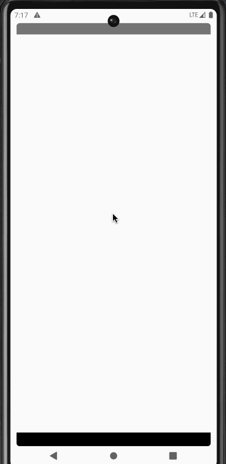
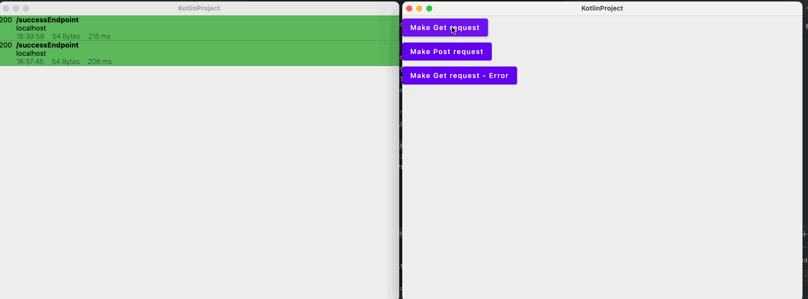
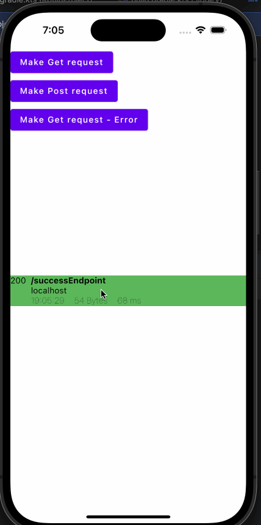

A Kotlin Multiplatfrom library to visualize network calls when using Ktor client in CMP apps.

Demos:

Android



Desktop



iOS


The library currently uses Compose multiplatfrom for UI (can be native UI later if the host app is not using CMP). The library uses room DB for storing network logs.

The repo includes sample project and a Ktor server to test the APIs locally.

Adding the dependency
```kotlin
// Add this to common main dependencies
// Make sure you don't ship this to production unless you really know what you are doing
commonMain.dependencies {
    implementation("io.github.chethann:network-monitor:<latest-version>")
}
// Make sure mavenCentral() is added in the list of repositories to resolve dependencies 
```

Adding the plugin to Ktor
```kotlin
HttpClient {
    install(NetworkCallsMonitor)
}
```

Android

```kotlin
// In the application class
NetworkMonitorInitializer.init {
            context = this@KotlinApplication
}
```
> A new activity which can be launched in a new task is added when you include the library.

Desktop

```kotlin

// In the main application function 

NetworkMonitorInitializer.init {
    appName = "MyNetworkTest" // Default value: networkMonitor
    bdDirectory = "${System.getProperty("java.io.tmpdir")}/db"
}
/** Customise bdDirectory to choose DB file path.
Default values:
"${System.getenv("LOCALAPPDATA")}/<appName> on windows
"${System.getProperty("user.home")}/Library/Application Support/<appName>" om mac
"${System.getProperty("user.home")}/.local/share/<appName>" on Linux
 */

// Add a new window to monitor network logs
Window(
    onCloseRequest = ::exitApplication,
    title = "KotlinProject",
) {
    NetworkCallsView()
}

```

iOS

```kotlin
/**
There is no eqivalent of multiple windows or multiple tasks in iOS. NetworkCallsView can be added based you your needs.
One such example (from the Demo above)
 */

fun MainViewController() = ComposeUIViewController { IOSView() }

@Composable
fun IOSView() {
    Column(modifier = Modifier.fillMaxSize()) {
        Box(modifier = Modifier.fillMaxWidth().fillMaxHeight(0.5f)) {
            App()
        }
        Box(modifier = Modifier.fillMaxWidth()) {
            NetworkCallsView()
        }
    }
}

```

If you want to clone the repo and test the sample app. You can run the Ktor server embedded using the below command

```
./gradlew testServer:run
```